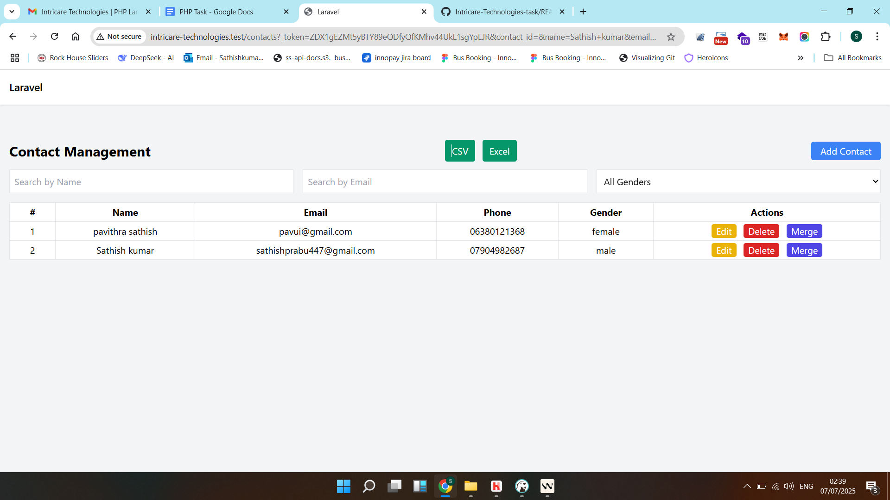
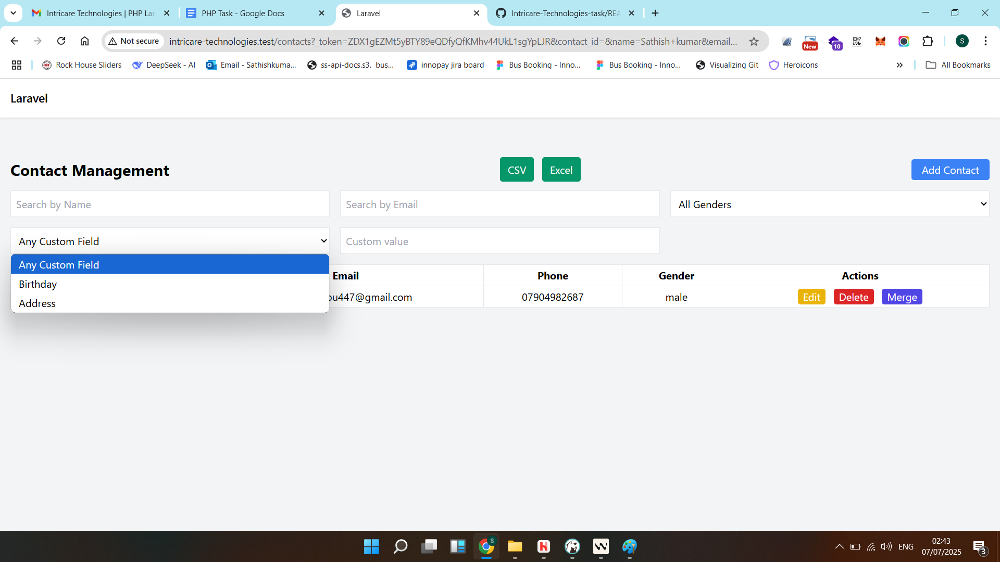
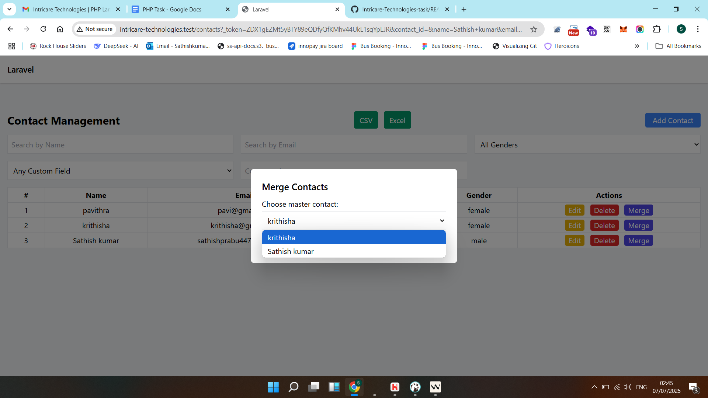
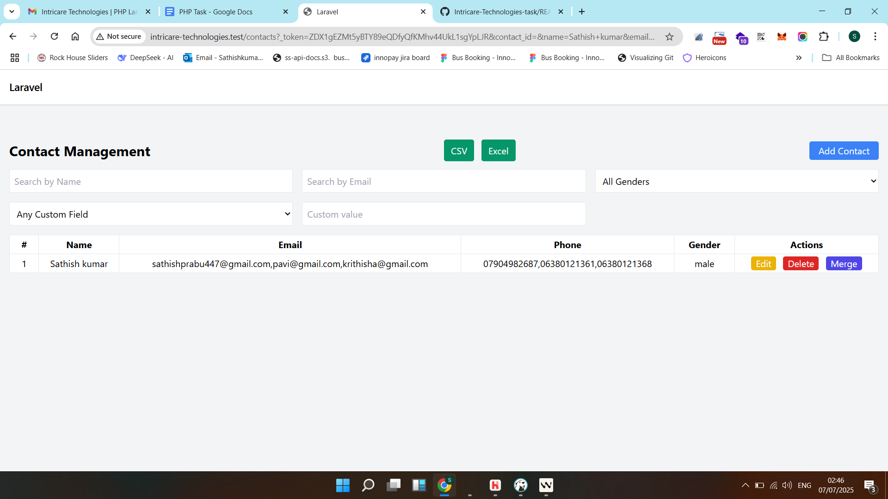

# Laravel CRM – Contacts Module

A lightweight Customer-Relationship Management demo built with Laravel 12.

It showcases:

* Dynamic **custom fields** (e.g. Birthday, Address) without code changes.
* **AJAX** CRUD via Tailwind-styled modals.
* Live **filtering** including any custom field.
* **Merge** two contacts safely, preserving phones/emails & custom data.
* Image/file uploads with strict FormRequest validation and 422 JSON error handling.
* **Export** contacts to CSV or Excel in one click.
* **Automated tests** with Pest & model factories for CRUD and export.
---

## 1. Requirements
• PHP 8.2+ • Composer • Node 18+ (optional for assets) • MySQL/MariaDB/SQLite

## 2. Setup
```bash
composer install
cp .env.example .env
php artisan key:generate
# set DB credentials
php artisan migrate --seed   # adds Birthday & Address custom fields
php artisan serve            # http://127.0.0.1:8000/contacts
```

## 3. Usage
### 3.1 Contacts CRUD
– Click **Add Contact** ➜ fill form ➜ green toast.
– Edit/Delete buttons work via AJAX.

### 3.2 Filtering
Search boxes + custom-field selector update the table instantly.

### 3.3 Merging
Press **Merge** on a row → choose master → success toast.

### 3.4 Custom fields
Visit `/custom-fields` to add any field; it appears automatically in forms and filters.

## 4. Validation rules
| Field | Rules |
|-------|-------|
| name | required, 2-255 chars |
| email | nullable, `email:rfc,dns`, unique |
| phone | nullable, digits 7-15, unique |
| gender | male/female/other |
| profile_image | image ≤2 MB |
| additional_file | file ≤5 MB |

Failures return 422 JSON and are shown as red toasts.

---

## 🖼️ Screenshots

### Basic Contact List (no custom fields)


### Contact List with Custom Fields


### Merge Modal


### Merge Success


Watch the demo of the Laravel assignment here:  
🔗 [Watch on YouTube](https://youtu.be/W8dkX93J7g0)


## 👤 Author

**Sathish Kumar**

- 💼 Senior Full-Stack Developer with 9+ years of experience
- 🔗 [LinkedIn](https://www.linkedin.com/in/sathish-kumar-p-322b27206/)
- 🧑‍💻 [GitHub](https://github.com/sathish447)
- ✉️ Email: sathishprabu447@gmail.com

---
© 2025 Intricare Technologies
